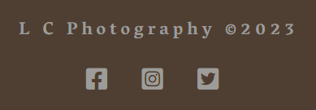

# **L C Photography**

This website was created as the 1st Milestone Project (User Centric Frontend Development) for Code Institute's web application development course.

[**__link to deployed site here__**](https://andrewcannan.github.io/L-C-Photography/)
<br><br>


<br><br>

---

# Contents

* [User Experience](#user-experience-ux)
    
    * [Owner Goals](#owners-goals)
    * [Visitor Goals](#visitor-goals)

* [Design](#design)

    * [Wireframes](#wireframes)
    * [Color Palette](#color-palette)
    * [Typography](#typography)
    * [Images](#images)
    * [Icons](#icons)

* [Features](#features)

    * [Header](#header)
    * [Footer](#footer)
    * [Modal](#modal)
    * [About me & Testimonials](#about-me-and-testimonials)
    * [Gallery](#gallery)
    * [Contact](#contact)
    * [Resonse](#response)
    * [Dissapearing Header](#dissapearing-header)
    * [Future Implementation](#future-implementation)

* [Technologies](#technologies)

    * [Languages](#languages)
    * [Frameworks, Libaries and Programs](#frameworks-libaries-and-programs)

* [Deployment](#deployment)


<br><br>

# User Experience UX
L C Photography is a fictional website made for a professional photographer Lloyd Chidgey.

 Lloyd would like to extend his online presence outside of social media so has opted to commission someone to develop a website for his business and hobby. It is designed to be responsive and accessible on a range of devices, making it easy to navigate for potential clients.
<br><br>
## Owners Goals
* Showcase photos and feeback from current/previous clients in order to attract new clients.
* Inform potential clients of personal background.
* Provide potential clients with a means to enquire about services provided.
* The website to have simple structure and be resposive to all screen sizes on various devices.
* For visitors to be able to easily navigate throughout the site to find content and get in touch.
<br><br>
## Visitor Goals   
* Find out information about the photographer.
* See previous work and what others think of the services.
* Be able to get in contact with the photographer.
* Easily navigate around the site.
* View the site on device at hand.
<br><br>
<br><br>
# Design

## Wireframes
<br>
Created wireframes using balsamiq software.
<br><br>
<details>
<summary>Wireframes</summary>
<br>
<details>
<summary>Homepage Desktop</summary>
<br>

</details>
<details>
<summary>Homepage Mobile</summary>
<br>

</details>
<details>
<summary>Gallery Desktop</summary>
<br>

</details>
<details>
<summary>Gallery Mobile</summary>
<br>

</details>
<details>
<summary>Contact Desktop</summary>

</details>
<details>
<summary>Contact Mobile</summary>
<br>

</details>
<details>
<summary>Response Desktop</summary>
<br>

</details>
<details>
<summary>Response Mobile</summary>
<br>

</details>
<br>
</details>
<br><br>

## Color Palette
Created color palette by taking colors from background image on Contact and Response pages. Used canva.com to generate 4 colors from the image.
<br><br>

<br><br>
## Typography
Used a website called [Fontpair](https://www.fontpair.co/all) to select a font pairing that i thought would work for the site. I chose Montserrat and Hind as they are easily readible and modern but dont distract the visitor away from the main purpose of a photography website which is to display the photographers work.

I chose Vesper Libre for the font for my Headers and Footers as I liked the look of them. 

* [Montserrat](https://fonts.google.com/specimen/Montserrat?query=montserrat)
* [Hind](https://fonts.google.com/specimen/Hind?query=hind)
* [Vesper Libre](https://fonts.google.com/specimen/Vesper+Libre?query=vesper)
<br><br>
## Images
Images sourced from royalty free site [Unsplash](https://unsplash.com/). Images were then converted into webp format, compressed using [TinyPNG](https://tinypng.com/) and resized to reduce file sizes and in turn loading times.
<br><br>
## Icons
All icons used on the site from [FontAwesome](https://fontawesome.com/).
<br><br>
<br><br>
# Features
The website is 4 pages. A **Home** page, a **Gallery** page, a **Contact** page and a **Response** page which is linked to when the form is successfully submitted on the the **Contact** page. There is also a Modal which contains the same form from the **Contact** page and also redirects to the **Response** page.
<br><br>
## Header
The header is responsive to all screen sizes. On large screens, it expands horizontally, while on mobile and narrower screens the menu bar is replaced with a hamburger toggler icon. Clicking this icon epands the navbar to reveal the menu items.


The menu items change color to indicate current page, also on mouseover to give feedback about choices to the user.
<br><br>


<br><br>
## Footer
Footer conatains the name of the site/business and links to social accounts. Links are to homepages of respective social media platforms only. It is responsive to all screen sizes.
<br><br>


<br><br>
## Modal 
The template for the Modal that appears when the **Book Now** button is clicked (found across the site) was taken from bootstrap. Just added my own form from the **Contact** page and added some styling in CSS. 
<br><br>


<br><br>
## About Me and Testimonials 
This area of the **Home** page offers information about Lloyd and and his passion for Photography. Also a few testaments to his past work to entice new clients. Bootstrap grid used for postioning and responsiveness. About me section of the page has three columns that also reorder dependant on the size of the device.
<br><br>


<br><br>
## Gallery
Gallery is seperated in to three rows using bootstrap grid and images set in CSS to display in a masonary flexible approach similar to that on the Love Running Project. Images scale up when hovered over only on large screen sizes.

**Book Now** button next to headings available for viewing on small screen sizes only, displays modal with contact form and links to **Response** page. 

Also only viewable on mobile is navigation menu fixed to the bottom right corner as the page gets particularly long with the amount of images, making it cumbersome to navigate from portrait photos to wedding photos for example. Bootstrap toggler template taken and adjusted and styled. 
<br><br>


<br><br>
## Contact
The contact page is a simple form with screen reader only labels. The form has an action of response.html so that the **submit** button links to the response page. Ideally this would post to an email address if developed further.

Border colors change on mouse hover to give some feedback to the user. All fields are required in order to submit.
<br><br>


<br><br>
## Response 
This page was made to give some visual feeback to the user that the submit button on the contact page has successfully submitted the form.
<br><br>


## Dissapearing Header 
In particular the **Gallery** page on mobile gets particurarly long on mobile, and I wanted a way for the user to find the nav links to other pages quicker so I found a script on [W3Schools](https://www.w3schools.com/howto/howto_js_navbar_hide_scroll.asp) and adjusted the pixel value to the height of my own navbar.
<br><br>
## Future Implementation 
Further development to the site could be using some php to create a database of form submissions, direct the user to another page (e.g. response page), and send an email.
<br><br>
<br><br>
# Technologies
## Languages
The site was mainly developed using HTML and CSS, though some JavaScript was used to to make the disappearing navbar feature.
<br><br>
## Frameworks, Libaries and Programs
* Bootstrap 5.2 
    * Used for Layout and Positioning. Also code used for navbar and modal.
* W3Schools
    * Code used for disappearing header/navbar.
* Git / Github
    * Used for version control, storage and deployment.
* Gitpod
    * IDE used.
* GoogleFonts
    * Used for importing fonts into stylesheet.
* Google Dev Tools
    * Used for troubleshooting and small style changes.
* Canva
    * Used to create a color pallette from background image.
* Convertio 
    * Used for file conversion.
* TinyPNG
    * Used for file compression
* Xconvert
    * Used for resizing images.
* Balsamiq
    * Used to create wireframes.
* Techsini
    * Used to create mock ups.
<br><br>
# Deployment

## Deployment
<br>

The project was deployed to GitHub Pages using the following steps...

1. Log in to GitHub and locate the [GitHub Repository](https://github.com/)
2. At the top of the Repository (not top of page), locate the "Settings" Button on the menu.
3. Scroll down the Settings page until you locate the "Pages" Section.
4. Under "Source", click the dropdown called "None" and select "Main Branch".
5. The page will automatically refresh.
6. Once the deployment process completed the published site's link will appear after the main title.
<br><br>

## Forking the GitHub Repository
<br>

By forking the GitHub Repository we make a copy of the original repository on our GitHub account to view and/or make changes without affecting the original repository by using the following steps...

1. Log in to GitHub and locate the [GitHub Repository](https://github.com/)
2. At the top of the Repository (not top of page) just above the "Settings" Button on the menu, locate the "Fork" Button.
3. You should now have a copy of the original repository in your GitHub account.
<br><br>

## Making a Local Clone
<br>

1. Log in to GitHub and locate the [GitHub Repository](https://github.com/)
2. Under the repository name, click "Clone or download".
3. To clone the repository using HTTPS, under "Clone with HTTPS", copy the link.
4. Open Git Bash
5. Change the current working directory to the location where you want the cloned directory to be made.
6. Type `git clone`, and then paste the URL you copied in Step 3.

```
$ git clone https://github.com/YOUR-USERNAME/YOUR-REPOSITORY
```

7. Press Enter. Your local clone will be created.

```
$ git clone https://github.com/YOUR-USERNAME/YOUR-REPOSITORY
> Cloning into `CI-Clone`...
> remote: Counting objects: 10, done.
> remote: Compressing objects: 100% (8/8), done.
> remove: Total 10 (delta 1), reused 10 (delta 1)
> Unpacking objects: 100% (10/10), done.
