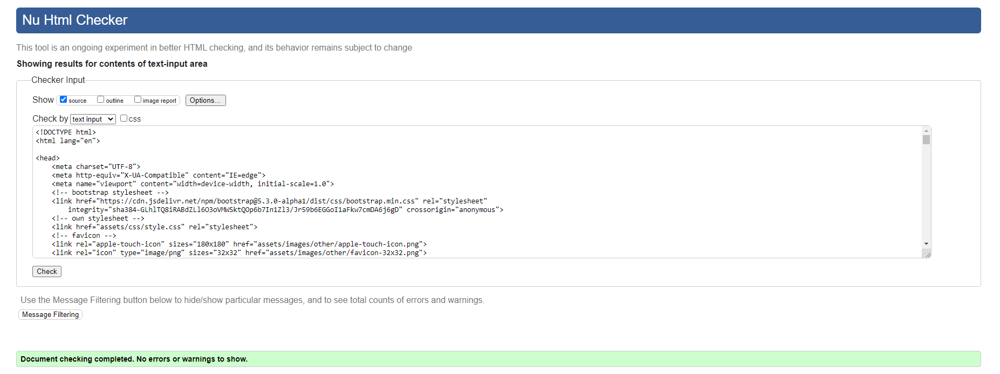
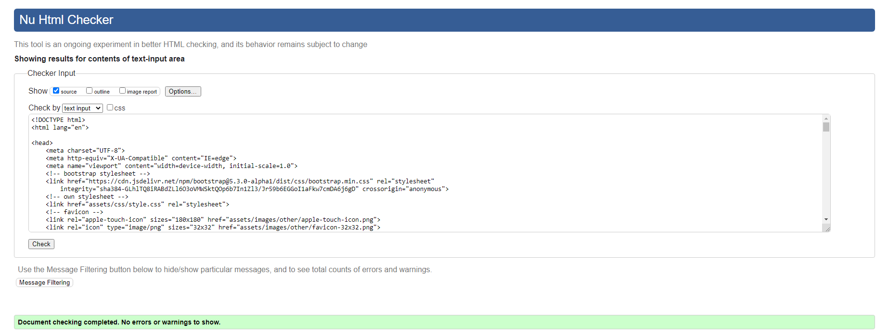

# **L C Photography**

This website was created as the 1st Milestone Project (User Centric Frontend Development) for Code Institute's web application development course.

[**__link to deployed site here__**](https://andrewcannan.github.io/L-C-Photography/)
<br><br>


<br><br>

---

# Contents

* [User Experience](#user-experience-ux)
    * [Owner Goals](#owners-goals)
    * [Visitor Goals](#visitor-goals)
<br><br>

* [Design](#design)
    * [Wireframes](#wireframes)
    * [Color Palette](#color-palette)
    * [Typography](#typography)
    * [Images](#images)
    * [Icons](#icons)
<br><br>

* [Features](#features)
    * [Header](#header)
    * [Footer](#footer)
    * [Modal](#modal)
    * [About me & Testimonials](#about-me-and-testimonials)
    * [Gallery](#gallery)
    * [Contact](#contact)
    * [Response](#response)
    * [404](#404)
    * [Dissapearing Header](#dissapearing-header)
    * [Future Implementation](#future-implementation)
<br><br>

* [Technologies](#technologies)
    * [Languages](#languages)
    * [Frameworks, Libaries and Programs](#frameworks-libaries-and-programs)
<br><br>

* [Testing](#testing)
    * [HTML Validation](#html-validation)
    * [CSS Validation](#css-validation)
    * [Accessibility](#accessibility)
    * [Performance](#performance)
    * [User Stories](#user-stories)
    * [Responsiveness](#responsiveness)
<br><br>

* [Deployment](#deployment)
<br><br>

* [Credits](#credits)


<br><br>

# User Experience UX
L C Photography is a fictional website made for a professional photographer Lloyd Chidgey.

 Lloyd would like to extend his online presence outside of social media so has opted to commission someone to develop a website for his business and hobby. It is designed to be responsive and accessible on a range of devices, making it easy to navigate for potential clients.
<br><br>
## Owners Goals
* Showcase photos and feeback from current/previous clients in order to attract new clients.
* Inform potential clients of personal background.
* Provide potential clients with a means to enquire about services provided.
* The website to have simple structure and be resposive to all screen sizes on various devices.
* For visitors to be able to easily navigate throughout the site to find content and get in touch.
<br><br>
## Visitor Goals   
* Find out information about the photographer.
* See previous work and what others think of the services.
* Be able to get in contact with the photographer.
* Easily navigate around the site.
* View the site on device at hand.
<br><br>
<br><br>
# Design

## Wireframes
<br>
Created wireframes using balsamiq software.
<br><br>
<details>
<summary>Wireframes</summary>
<br>
<details>
<summary>Homepage Desktop</summary>
<br>

</details>
<details>
<summary>Homepage Mobile</summary>
<br>

</details>
<details>
<summary>Gallery Desktop</summary>
<br>

</details>
<details>
<summary>Gallery Mobile</summary>
<br>

</details>
<details>
<summary>Contact Desktop</summary>

</details>
<details>
<summary>Contact Mobile</summary>
<br>

</details>
<details>
<summary>Response Desktop</summary>
<br>

</details>
<details>
<summary>Response Mobile</summary>
<br>

</details>
<br>
</details>
<br><br>

## Color Palette
Created color palette by taking colors from background image on Contact and Response pages. Used canva.com to generate 4 colors from the image.
<br><br>

<br><br>
## Typography
Used a website called [Fontpair](https://www.fontpair.co/all) to select a font pairing that i thought would work for the site. I chose Montserrat and Hind as they are easily readible and modern but dont distract the visitor away from the main purpose of a photography website which is to display the photographers work.

I chose Vesper Libre for the font for my Headers and Footers as I liked the look of them. 

* [Montserrat](https://fonts.google.com/specimen/Montserrat?query=montserrat)
* [Hind](https://fonts.google.com/specimen/Hind?query=hind)
* [Vesper Libre](https://fonts.google.com/specimen/Vesper+Libre?query=vesper)
<br><br>
## Images
Images sourced from royalty free site [Unsplash](https://unsplash.com/). Images were then converted into webp format, compressed using [TinyPNG](https://tinypng.com/) and resized to reduce file sizes and in turn loading times.
<br><br>
## Icons
All icons used on the site from [FontAwesome](https://fontawesome.com/).
<br><br>
<br><br>
# Features
The website is 4 pages. A **Home** page, a **Gallery** page, a **Contact** page and a **Response** page which is linked to when the form is successfully submitted on the the **Contact** page. There is also a Modal which contains the same form from the **Contact** page and also redirects to the **Response** page.
<br><br>
## Header
The header was created to allow to user to easily navigate throughout the site. It is responsive to all screen sizes. 

On large screens, it expands horizontally, while on mobile and narrower screens the menu bar is replaced with a hamburger toggler icon. Clicking this icon epands the navbar to reveal the menu items.


The menu items change color to indicate current page, also on mouseover to give feedback about choices to the user.
<br><br>


<br><br>
## Footer
The footer allows the user to navigate to photographers social media accounts to see more work or get in contact via these platforms.

Footer conatains the name of the site/business and links to social accounts. Links are to homepages of respective social media platforms only. It is responsive to all screen sizes.
<br><br>


<br><br>
## Modal 
Modal allows user to have an easily accessible means of contacting the photographer no matter where on the site they are currently viewing.

The template for the Modal that appears when the **Book Now** button is clicked (found across the site) was taken from bootstrap. Just added my own form from the **Contact** page and added some styling in CSS. 
<br><br>


<br><br>
## About Me and Testimonials 
Theses sections allow the user to gain some personal background information about the photographer in order to make a decision if they want to comission him for some work.

This area of the **Home** page offers information about Lloyd and and his passion for Photography. Also a few testaments to his past work to entice new clients. Bootstrap grid used for postioning and responsiveness. About me section of the page has three columns that also reorder dependant on the size of the device.
<br><br>


<br><br>
## Gallery
Gallery allows the user to see previous work done by the photographer.

Gallery is seperated in to three rows using bootstrap grid and images set in CSS to display in a masonary flexible approach similar to that on the Love Running Project. Images scale up when hovered over only on large screen sizes.

**Book Now** button next to headings available for viewing on small screen sizes only, displays modal with contact form and links to **Response** page. 

Also only viewable on mobile is navigation menu fixed to the bottom right corner as the page gets particularly long with the amount of images, making it cumbersome to navigate from portrait photos to wedding photos for example. Bootstrap toggler template taken and adjusted and styled. 
<br><br>


<br><br>
## Contact
The contact page is a simple form with screen reader only labels. The form has an action of response.html so that the **submit** button links to the response page. Ideally this would post to an email address if developed further.

Border colors change on mouse hover to give some feedback to the user. All fields are required in order to submit.
<br><br>


<br><br>
## Response 
This page was made to give some visual feeback to the user that the submit button on the contact page has successfully submitted the form.
<br><br>


<br><br>
## 404
A 404 error page was added to allow the user to easily return to Homepage.
<br><br>

<br><br>
## Dissapearing Header 
In particular the **Gallery** page on mobile gets particurarly long on mobile, and I wanted a way for the user to find the nav links to other pages quicker so I found a script on [W3Schools](https://www.w3schools.com/howto/howto_js_navbar_hide_scroll.asp) and adjusted the pixel value to the height of my own navbar.
<br><br>
## Future Implementation 
Further development to the site could be using some php to create a database of form submissions, direct the user to another page (e.g. response page), and send an email.
<br><br>
<br><br>
# Technologies
## Languages
The site was mainly developed using HTML and CSS, though some JavaScript was used to to make the disappearing navbar feature.
<br><br>
## Frameworks, Libaries and Programs
* Bootstrap 5.2 
    * Used for Layout and Positioning. Also code used for navbar and modal.
* W3Schools
    * Code used for disappearing header/navbar.
* Git / Github
    * Used for version control, storage and deployment.
* Gitpod
    * IDE used.
* GoogleFonts
    * Used for importing fonts into stylesheet.
* Google Dev Tools
    * Used for troubleshooting and small style changes.
* Canva
    * Used to create a color pallette from background image.
* Convertio 
    * Used for file conversion.
* TinyPNG
    * Used for file compression
* Xconvert
    * Used for resizing images.
* Balsamiq
    * Used to create wireframes.
* Techsini
    * Used to create mock ups.
* EZgif
    * Used to create gifs for readme.
* WAVE 
    * Used to check accessibility of site.
* Favicon.io
    * Used to create a favicon.
<br><br>
# Testing
## HTML Validation
The [W3C Markup Validation Service](https://validator.w3.org/) was used to validate the HTML code. Passed with 0 errors, just warnings for hyphens in the comments.
<details>
<summary>Homepage</summary>
<br>

</details>
<details>
<summary>Gallery</summary>
<br>

</details>
<details>
<summary>Contact</summary>
<br>

</details>
<details>
<summary>Response</summary>
<br>

</details>
<details>
<summary>404</summary>
<br>

</details>
<br><br>

## CSS Validation
The [W3C Markup Validation Service](https://jigsaw.w3.org/css-validator/) was used to validate the CSS code. Passed with 0 errors, just a warning as imported stylesheet for fonts is not checked by the service.
<details>
<summary>Stylesheet</summary>
<br>

</details>
<br><br>

## Accessibility
The [WAVE WebAIM web accessibility evaluation tool](https://wave.webaim.org/) was used to check the site conforms with high accessibility standards. Most pages show same warning for "redundant link" as the home nav item and brand both link to index.html, also shows two contrast errors for text over images which I believe to be a shortcoming of wave. Cannot analyze the images so pressumes the background is white.
<details>
<summary>Homepage</summary>
<br>


</details>
<details>
<summary>Gallery</summary>
<br>


</details>
<details>
<summary>Contact</summary>
<br>

</details>
<details>
<summary>Response</summary>
<br>

</details>
<details>
<summary>404</summary>
<br>

</details> 
<br><br>

## Performance
Lighthouse within google developer tools was used to check the overall performance of the site.
<details>
<summary>Homepage</summary>
<br>

</details>
<details>
<summary>Gallery</summary>
<br>
Low performance score due to amount of images. Files already resized, formatted and compressed.

</details>
<details>
<summary>Contact</summary>
<br>

</details>
<details>
<summary>Response</summary>
<br>

</details>
<details>
<summary>404</summary>
<br>

</details>
<br><br>

## User Stories
* Find out information about the photographer.

| Feature     | Action      | Expected Result | Actual Result |
| ----------- | ----------- |---------------- | ------------- |
| About Me Section | Scroll down on Homepage/Click `About Me` link over Hero Image | To find an about me section beneath Hero Image | Works as expected |
<br><br>
* See previous work and what others think of the services.

| Feature     | Action      | Expected Result | Actual Result |
| ----------- | ----------- |---------------- | ------------- |
| Gallery Page | Scroll down through images | To see photos from the photographer | Works as expected |
| Testimonials Section | Scroll down on Homepage | To see reviews from past clients | Works as expected |
| Social Media Links | Click links in Footer | To be redirected to photographers socials to see further photos | Works as expected |
<br><br>
* Be able to get in contact with the photographer.

| Feature     | Action      | Expected Result | Actual Result |
| ----------- | ----------- |---------------- | ------------- |
| Modal | Click `Book Now` button | Modal to appear with contact form | Works as expected |
| Contact Page | Fill in Form | Form to send information to photographer | Works as expected |
| Social Media Links | Click links in Footer | To be redirected to photographers socials to contact there | Works as expected |
<br><br>
* Easily navigate around the site.

| Feature     | Action      | Expected Result | Actual Result |
| ----------- | ----------- |---------------- | ------------- |
| Navbar/Header | Scroll up | Navbar/Header to be displayed and all links to redirect correctly | Works as expected |
<br><br>
## Responsiveness
Tested across various devices using Google Dev Tools and real world devices for expected look and layout. 

<details>
<summary>Samsung S22 Ultra</summary>
<br>

| Device | Page | Result |
| ----------- | ----------- |---------------- |
| Samsung S22 Ultra| Homepage | &check; |
| | Gallery | &check; |
| | Contact | &check; |
| | Response | &check; |
| | 404 | &check; |
| | Modal | &check; |
</details>
<details>
<summary>IPhone 12 Pro</summary>
<br>

| Device | Page | Result |
| ----------- | ----------- |---------------- |
| IPhone 12 Pro| Homepage | &check; |
| | Gallery | &check; |
| | Contact | &check; |
| | Response | &check; |
| | 404 | &check; |
| | Modal | &check; |
</details>
<details>
<summary>IPhone 6/7/8</summary>
<br>

| Device | Page | Result |
| ----------- | ----------- |---------------- |
| IPhone 6/7/8| Homepage | &check; |
| | Gallery | &check; |
| | Contact | &check; |
| | Response | &check; |
| | 404 | &check; |
| | Modal | &check; |
</details>
<details>
<summary>IPad Pro 2</summary>
<br>

| Device | Page | Result |
| ----------- | ----------- |---------------- |
| IPad Pro 2| Homepage | &check; |
| | Gallery | &check; |
| | Contact | &check; |
| | Response | &check; |
| | 404 | &check; |
| | Modal | &check; |
</details>
<details>
<summary>Nest Hub</summary>
<br>

| Device | Page | Result |
| ----------- | ----------- |---------------- |
| Nest Hub| Homepage | &check; |
| | Gallery | &check; |
| | Contact | &check; |
| | Response | &check; |
| | 404 | &check; |
| | Modal | &check; |
</details>
<details>
<summary>Samsung Galaxy A51/71</summary>
<br>

| Device | Page | Result |
| ----------- | ----------- |---------------- |
| Samsung Galaxy A51/71| Homepage | &check; |
| | Gallery | &check; |
| | Contact | &check; |
| | Response | &check; |
| | 404 | &check; |
| | Modal | &check; |
</details>
<details>
<summary>Surface Pro 7</summary>
<br>

| Device | Page | Result |
| ----------- | ----------- |---------------- |
| Surface Pro 7| Homepage | &check; |
| | Gallery | &check; |
| | Contact | &check; |
| | Response | &check; |
| | 404 | &check; |
| | Modal | &check; |
</details>

<br><br>
# Deployment
## Deployment
<br>

The project was deployed to GitHub Pages using the following steps...

1. Log in to GitHub and locate the [GitHub Repository](https://github.com/)
2. At the top of the Repository (not top of page), locate the "Settings" Button on the menu.
3. Scroll down the Settings page until you locate the "Pages" Section.
4. Under "Source", click the dropdown called "None" and select "Main Branch".
5. The page will automatically refresh.
6. Once the deployment process completed the published site's link will appear after the main title.
<br><br>

## Forking the GitHub Repository
<br>

By forking the GitHub Repository we make a copy of the original repository on our GitHub account to view and/or make changes without affecting the original repository by using the following steps...

1. Log in to GitHub and locate the [GitHub Repository](https://github.com/)
2. At the top of the Repository (not top of page) just above the "Settings" Button on the menu, locate the "Fork" Button.
3. You should now have a copy of the original repository in your GitHub account.
<br><br>

## Making a Local Clone
<br>

1. Log in to GitHub and locate the [GitHub Repository](https://github.com/)
2. Under the repository name, click "Clone or download".
3. To clone the repository using HTTPS, under "Clone with HTTPS", copy the link.
4. Open Git Bash
5. Change the current working directory to the location where you want the cloned directory to be made.
6. Type `git clone`, and then paste the URL you copied in Step 3.

```
$ git clone https://github.com/YOUR-USERNAME/YOUR-REPOSITORY
```

7. Press Enter. Your local clone will be created.

```
$ git clone https://github.com/YOUR-USERNAME/YOUR-REPOSITORY
> Cloning into `CI-Clone`...
> remote: Counting objects: 10, done.
> remote: Compressing objects: 100% (8/8), done.
> remove: Total 10 (delta 1), reused 10 (delta 1)
> Unpacking objects: 100% (10/10), done.
```
<br><br>
# Credits
<details>
<summary>Miscellaneous Images</summary>
<br>

* Hero Image - Julian Reinhart on `Unsplash`
* Background Image Contact/Response page - Mylene Tremoyet on `Unsplash`
* Background Image 404 page - Laula Co on `Unsplash`
* Photo of LLoyd - Colin Lloyd on `Unsplash`
* Abbey, Former client - Christina Wocintechchat on `Unsplash`
* John, Former client - Ali Morshedlou on `Unsplash`
</details>
<details>
<summary>Wedding Images</summary>
<br>

* Wedding photo 1 - Jeremy Wong on `Unsplash`
* Wedding photo 2 - CVG Alvaro on `Unsplash`
* Wedding photo 3 - Arion Reyvonputra on `Unsplash`
* Wedding photo 4 - Drew Coffman on `Unsplash`
* Wedding photo 5 - Vitor Monthay on `Unsplash`
* Wedding photo 6 - Victoria Priessnitz on `Unsplash`
* Wedding photo 7 - Jeongim Kwon on `Unsplash`
* Wedding photo 8 - Elvis Bekmanis on `Unsplash`
* Wedding photo 9 - Leonardo Miranda on `Unsplash`
* Wedding photo 10 - Marissa Morton on `Unsplash`
* Wedding photo 11 - Ulyana Tim on `Unsplash`
* Wedding photo 12 - Nick Karvounis on `Unsplash`
</details>
<details>
<summary>Concert Images</summary>
<br>

* Concert photo 1 - Evegeniy Smersh on `Unsplash`
* Concert photo 2 - Hector Bermudez on `Unsplash`
* Concert photo 3 - Ilip Andrejevic on `Unsplash`
* Concert photo 4 - Joel Muniz on `Unsplash`
* Concert photo 5 - John Crozier on `Unsplash`
* Concert photo 6 - Jose Pinto on `Unsplash`
* Concert photo 7 - Kai Oberhauser on `Unsplash`
* Concert photo 8 - Manuel Sanchez on `Unsplash`
* Concert photo 9 - Natalie Parham on `Unsplash`
* Concert photo 10 - Ornelas Tapia on `Unsplash`
* Concert photo 11 - Vlad Shalaginov on `Unsplash`
* Concert photo 12 - Wan San Yip on `Unsplash`
</details>
<details>
<summary>Concert Images</summary>
<br>

* Portrait photo 1 - Craig Mckay on `Unsplash`
* Portrait photo 2 - Daniel Lincoln on `Unsplash`
* Portrait photo 3 - Ethan Hoover on `Unsplash`
* Portrait photo 4 - Joseph Pearson on `Unsplash`
* Portrait photo 5 - Karl Magnuson on `Unsplash`
* Portrait photo 6 - Tegan Mierle on `Unsplash`
* Portrait photo 7 - Michael Austin on `Unsplash`
* Portrait photo 8 - Mubariz Mehdizadeh on `Unsplash`
* Portrait photo 9 - Noah Silliman on `Unsplash`
* Portrait photo 10 - Tefan Stefancik on `Unsplash`
* Portrait photo 11 - Matheus Ferrero on `Unsplash`
* Portrait photo 12 - Warren Wong on `Unsplash`
</details>
<details>
<summary>Other Credits</summary>
<br>

* Masonary Style Gallery Images - Inspiration from Love Running Project
* Script for Navbar - W3Schools
</details>


